# HRM Test Generation System - Comprehensive Mermaid Diagrams

Complete architectural documentation using Mermaid diagrams.

---

## Table of Contents
1. [Overall System Architecture](#1-overall-system-architecture)
2. [Component Architecture](#2-component-architecture)
3. [Data Flow Diagram](#3-data-flow-diagram)
4. [API Workflow](#4-api-workflow)
5. [Neural Network Architecture](#5-neural-network-architecture)
6. [RAG Integration](#6-rag-integration)
7. [SQE Agent Workflow](#7-sqe-agent-workflow)
8. [Test Generation Pipeline](#8-test-generation-pipeline)
9. [Deployment Architecture](#9-deployment-architecture)
10. [Class Diagrams](#10-class-diagrams)

---

## 1. Overall System Architecture

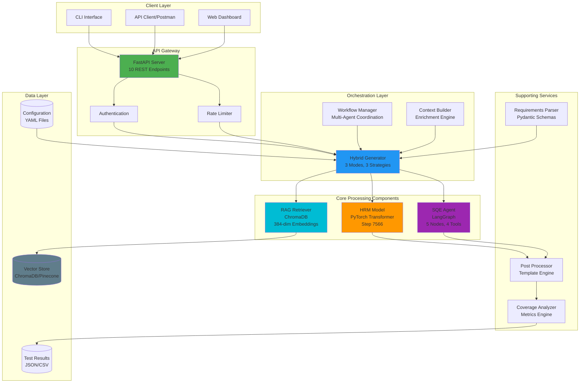

---

## 2. Component Architecture

### 2.1 FastAPI Service Architecture

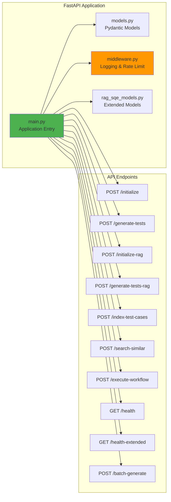

### 2.2 Orchestration Components

```mermaid
graph TB
    subgraph "Hybrid Generator"
        HG_INIT[Initialize<br/>HRM, SQE, RAG]
        HG_MODE{Generation Mode?}
        HG_HRM[HRM Only Path]
        HG_SQE[SQE Only Path]
        HG_HYBRID[Hybrid Path]
        HG_MERGE[Merge Strategy<br/>Weighted/Union/Intersection]
        HG_OUTPUT[Merged Results]
        
        HG_INIT --> HG_MODE
        HG_MODE -->|hrm_only| HG_HRM
        HG_MODE -->|sqe_only| HG_SQE
        HG_MODE -->|hybrid| HG_HYBRID
        
        HG_HRM --> HG_MERGE
        HG_SQE --> HG_MERGE
        HG_HYBRID --> HG_MERGE
        HG_MERGE --> HG_OUTPUT
    end
    
    subgraph "Workflow Manager"
        WM_VALIDATE[Validate Requirements]
        WM_GENERATE[Generate Tests]
        WM_ANALYZE[Analyze Coverage]
        WM_INDEX[Auto-Index Results]
        WM_STATS[Collect Statistics]
        
        WM_VALIDATE --> WM_GENERATE
        WM_GENERATE --> WM_ANALYZE
        WM_ANALYZE --> WM_INDEX
        WM_INDEX --> WM_STATS
    end
    
    subgraph "Context Builder"
        CB_EXTRACT[Extract Context]
        CB_RAG[RAG Retrieval]
        CB_ENRICH[Enrich with History]
        CB_FORMAT[Format for Models]
        
        CB_EXTRACT --> CB_RAG
        CB_RAG --> CB_ENRICH
        CB_ENRICH --> CB_FORMAT
    end
    
    style HG_INIT fill:#2196F3
    style WM_VALIDATE fill:#9C27B0
    style CB_EXTRACT fill:#00BCD4
```

### 2.3 Core Models Architecture

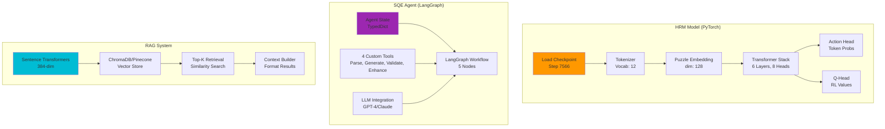

---

## 3. Data Flow Diagram

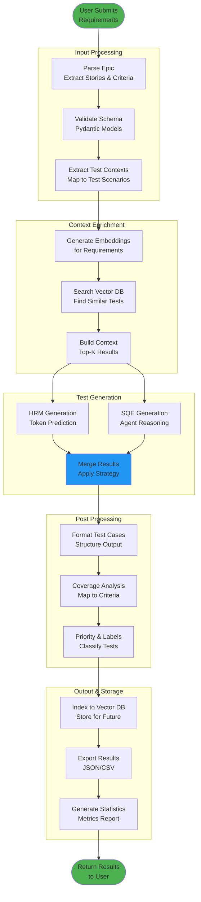

---

## 4. API Workflow

### 4.1 Test Generation Workflow (RAG-Enhanced)

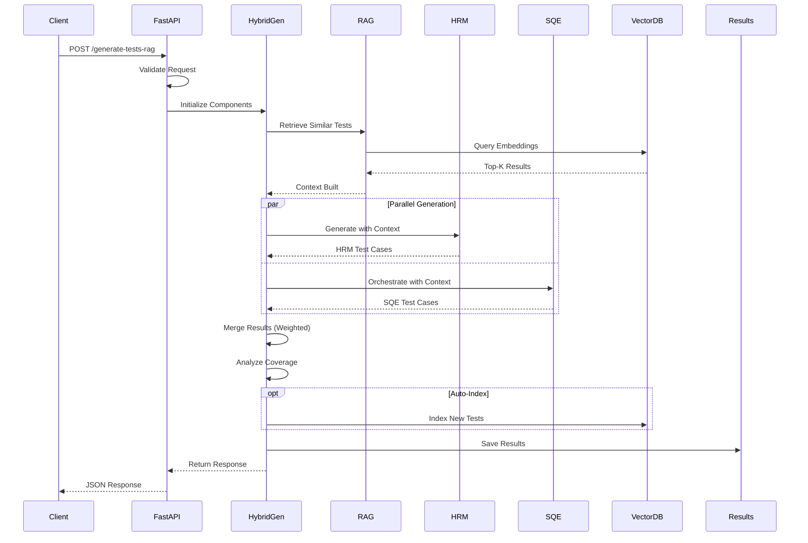

### 4.2 Complete Workflow Execution

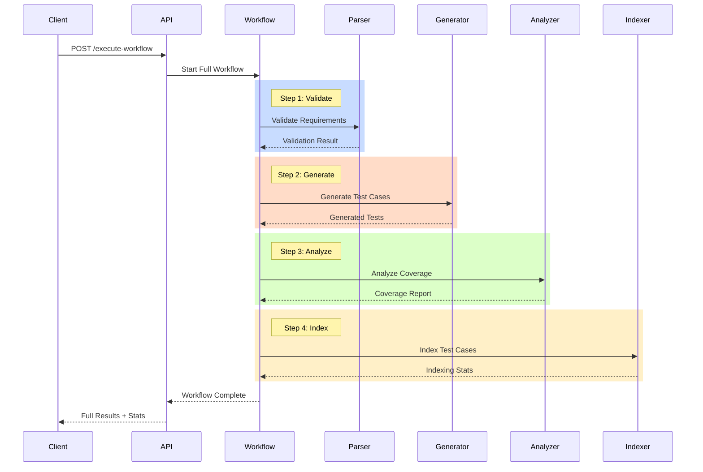

---

## 5. Neural Network Architecture

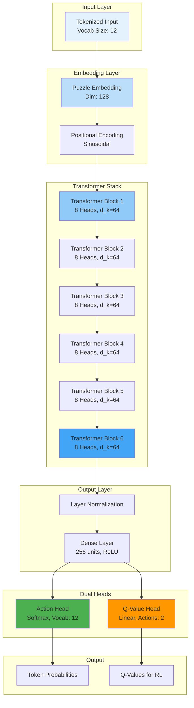

### Transformer Block Detail

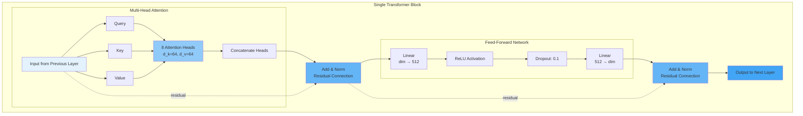

---

## 6. RAG Integration

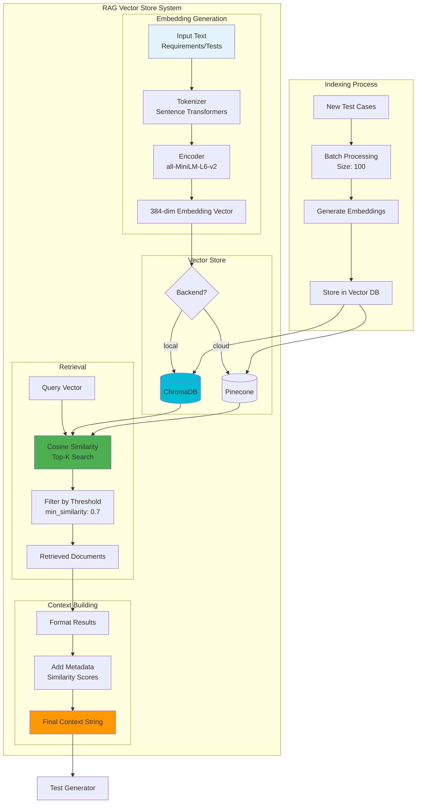

---

## 7. SQE Agent Workflow

```mermaid
stateDiagram-v2
    [*] --> Initialize
    
    state Initialize {
        [*] --> LoadState
        LoadState --> LoadTools
        LoadTools --> BuildGraph
        BuildGraph --> [*]
    }
    
    Initialize --> ParseRequirements
    
    state ParseRequirements {
        [*] --> ValidateInput
        ValidateInput --> ExtractStructure
        ExtractStructure --> [*]
    }
    
    ParseRequirements --> RetrieveContext
    
    state RetrieveContext {
        [*] --> QueryRAG
        QueryRAG --> BuildContext
        BuildContext --> [*]
    }
    
    RetrieveContext --> PlanTests
    
    state PlanTests {
        [*] --> AnalyzeRequirements
        AnalyzeRequirements --> GenerateStrategy
        GenerateStrategy --> DefineScenarios
        DefineScenarios --> [*]
    }
    
    PlanTests --> GenerateTests
    
    state GenerateTests {
        [*] --> UseHRMTool
        UseHRMTool --> EnhanceWithSQE
        EnhanceWithSQE --> [*]
    }
    
    GenerateTests --> ValidateResults
    
    state ValidateResults {
        [*] --> CheckCompleteness
        CheckCompleteness --> VerifyCoverage
        VerifyCoverage --> [*]
    }
    
    ValidateResults --> Decision
    
    state Decision <<choice>>
    Decision --> GenerateTests : Incomplete
    Decision --> Finalize : Complete
    
    state Finalize {
        [*] --> FormatOutput
        FormatOutput --> AddMetadata
        AddMetadata --> [*]
    }
    
    Finalize --> [*]
```

### SQE Agent Tools

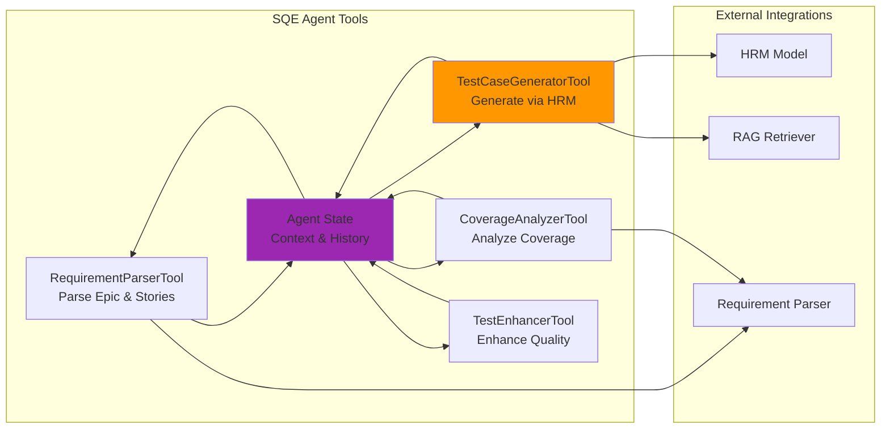

---

## 8. Test Generation Pipeline

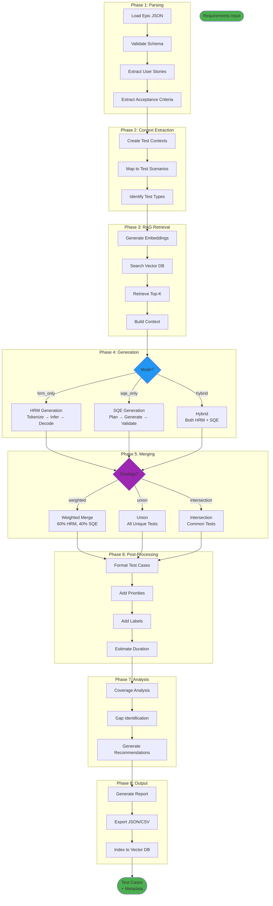

---

## 9. Deployment Architecture

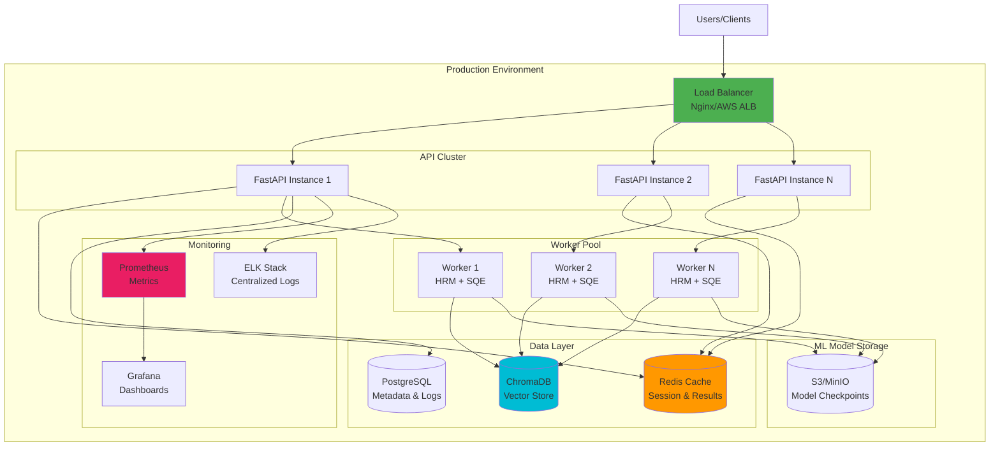

---

## 10. Class Diagrams

### 10.1 Core Models

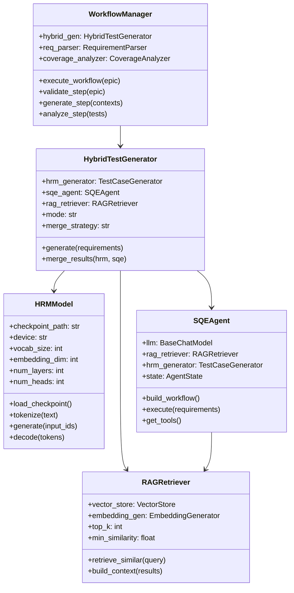

### 10.2 Data Models

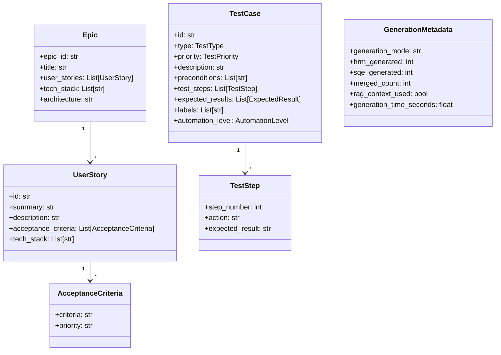

---

## Usage

To render these diagrams:

1. **GitHub/GitLab**: Copy directly to README.md (automatic rendering)
2. **VS Code**: Install "Markdown Preview Mermaid Support" extension
3. **Online**: Use [Mermaid Live Editor](https://mermaid.live/)
4. **Documentation Sites**: Works with Docusaurus, MkDocs, etc.

---

## Notes

- All diagrams are based on actual implementation
- Color coding: Green (API), Blue (Orchestration), Orange (HRM), Purple (SQE), Cyan (RAG)
- Diagrams are maintained alongside code changes
- Use Mermaid v9.0+ for best compatibility

---

**Last Updated:** October 7, 2025  
**HRM Version:** v9 Optimized (Step 7566)  
**Status:** Production Ready (85%)
