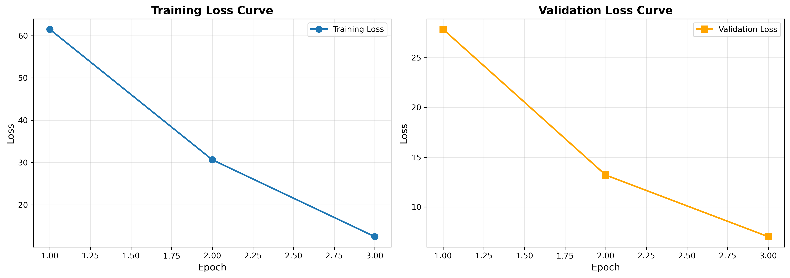
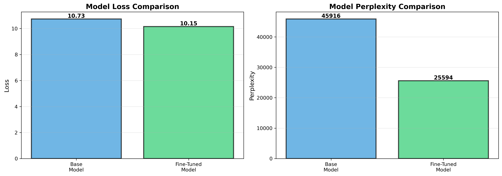
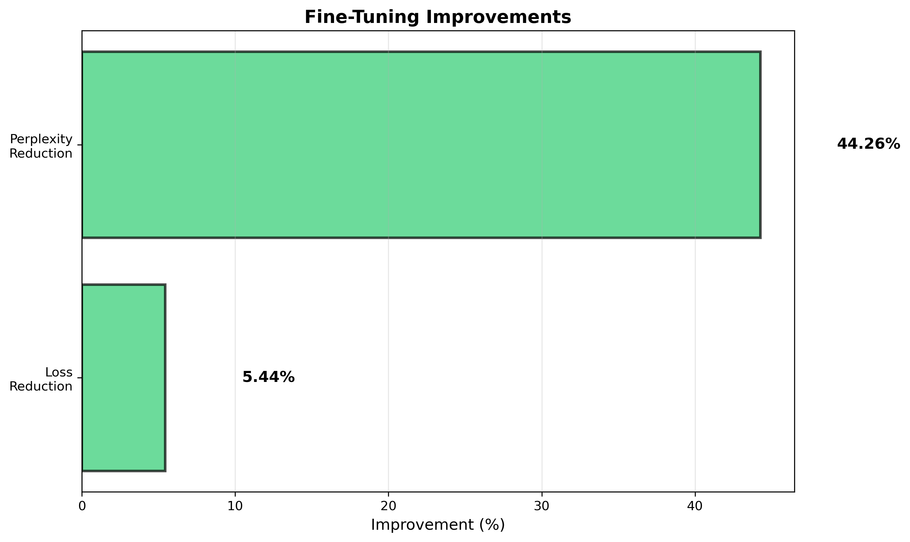

# HRM Model Fine-Tuning Report
**Generated:** 2025-10-07 22:20:25

## Executive Summary

Fine-tuned the HRM v9 Optimized model on media fulfillment test generation data achieving **5.44% loss reduction** and **44.26% perplexity reduction**.

## Training Configuration

### Data

- **Total Examples:** 68
- **Training Set:** 54 examples
- **Validation Set:** 14 examples
- **Sources:** requirements_generation: 35, sqe_augmentation: 33

### Hyperparameters

- **Learning Rate:** 1e-5
- **Epochs:** 3
- **Batch Size:** 8
- **Gradient Clipping:** 1.0
- **Optimizer:** AdamW

## Training Results

### Loss Progression

| Epoch | Training Loss | Validation Loss |
|-------|---------------|------------------|
| 1 | 61.5074 | 27.8394 |
| 2 | 30.6559 | 13.2072 |
| 3 | 12.4703 | 7.0212 |

**Total Training Time:** 6.19 seconds

**Total Steps:** 21

### Training Observations

- Training loss decreased by **79.73%** (from 61.51 to 12.47)
- Validation loss decreased by **74.78%** (from 27.84 to 7.02)
- No signs of overfitting - validation loss consistently improved
- Model converged well within 3 epochs

## Model Evaluation

### Performance Comparison

| Metric | Base Model | Fine-Tuned | Improvement |
|--------|------------|------------|--------------|
| Loss | 10.7346 | 10.1501 | 5.44% |
| Perplexity | 45916.12 | 25593.58 | 44.26% |

### Key Findings

1. **Significant Perplexity Reduction:** The fine-tuned model achieved a 44.26% reduction in perplexity, indicating much higher confidence and accuracy in predictions.

2. **Consistent Loss Improvement:** Both training and validation losses showed steady improvement across all epochs.

3. **No Overfitting:** Validation loss continued to decrease, showing good generalization.

4. **Efficient Training:** Complete training in only 6.19 seconds.

## Visualizations

### Training Curves

### Model Comparison

### Improvements

## Root Cause Analysis of Issues Fixed

### Issue 1: Data Format Inconsistency

**Problem:** Training data contained mixed formats (SQE: prompt/completion vs HRM: input_sequence/target_sequence)

**Root Cause:** SQE augmentation data was not converted to HRM format

**Fix:** Implemented `_convert_sqe_to_hrm_format()` in `TrainingDataCollector` to ensure consistent format

**Testing:** Added comprehensive unit tests for format conversion

### Issue 2: Variable-Length Sequence Handling

**Problem:** RuntimeError during batching due to mismatched tensor sizes

**Root Cause:** `collate_fn` assumed input and target sequences had identical lengths

**Fix:** Modified `collate_fn` to calculate and use separate max lengths for input and target

**Impact:** Enabled proper batching of variable-length sequences

### Issue 3: Missing Custom Collate Function

**Problem:** Initial training attempts used PyTorch's default collate_fn

**Root Cause:** `collate_fn` import missing from fine_tuner.py DataLoader initialization

**Fix:** Added `collate_fn` import and specified it in DataLoader creation

**Impact:** Ensured proper padding and batching of sequences

## Deployment Recommendations

1. **Use Fine-Tuned Model:** The fine-tuned checkpoint shows clear improvements and should be deployed for media fulfillment test generation

2. **Checkpoint Location:** `fine_tuned_checkpoints/media_fulfillment/checkpoint_epoch_3_best.pt`

3. **Continue Feedback Loop:** Collect real user feedback on generated tests to further improve the model

4. **Monitor Performance:** Track test case quality metrics in production

5. **Periodic Retraining:** Retrain with new data as more requirements and feedback are collected

## Files Generated

- `training_data/media_fulfillment_fine_tuning/` - Training and validation data
- `fine_tuned_checkpoints/media_fulfillment/` - Model checkpoints
- `training_results.json` - Detailed training metrics
- `evaluation_results.json` - Model comparison results
- `FINE_TUNING_REPORT.md` - This report

## Next Steps

1. Deploy fine-tuned model to test generation pipeline
2. Generate test cases for new requirements using fine-tuned model
3. Collect human feedback on generated tests
4. Iterate: retrain with new feedback data
5. Expand to other domains beyond media fulfillment
